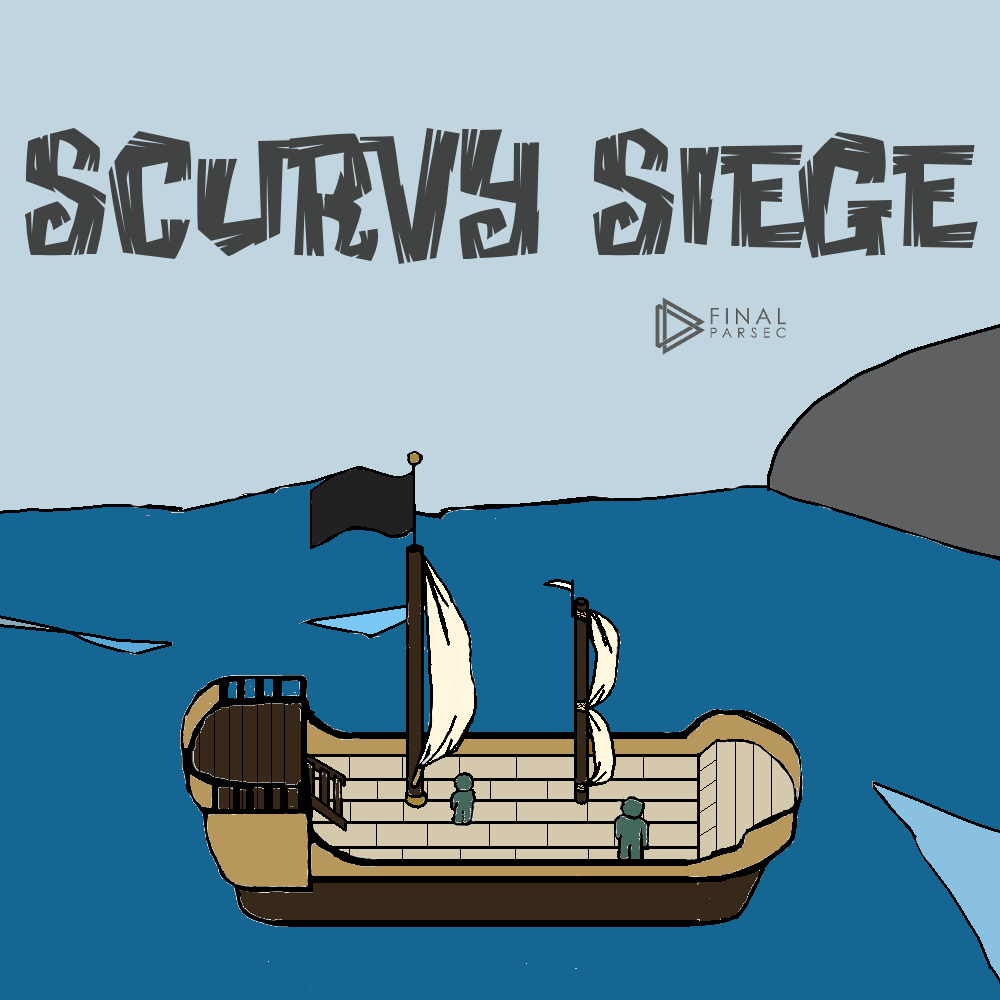

Scurvy Siege
======
**Scurvy Siege** is a pirate-themed tower defense game for Android and PC.

Play as Piro and lead your crew to fight off undying waves of zombies.

*Somewhere in the Indian Ocean, 1723. The Golden Age of Piracy.*

When a zombie apocalypse threatens his wench, his crew, and his way of life, pirate Captain Piro is forced to pick up his hook and defend against surges of fiends he once called legends. Suffer the grueling fight for survival across land and sea, as Piro works to plunder a new world, one hell-beast at a time. 

## How to Play

Scurvy Siege is currently pre-release, so you'll need to build it yourself to play.

Install [Unity3d](https://unity3d.com/) and open the root directory of this repository.

## History

This game started as a fork from Aurora Tower Defense 1.3.1 in October 2015.

## Contact
* Homepage: [finalparsec.com](http://finalparsec.com)
* Twitter: [@Final_Parsec](https://twitter.com/Final_Parsec "@Final_Parsec on twitter")
* YouTube: [Tutorials & Streams](https://www.youtube.com/c/FinalParsec "Final Parsec on Youtube")